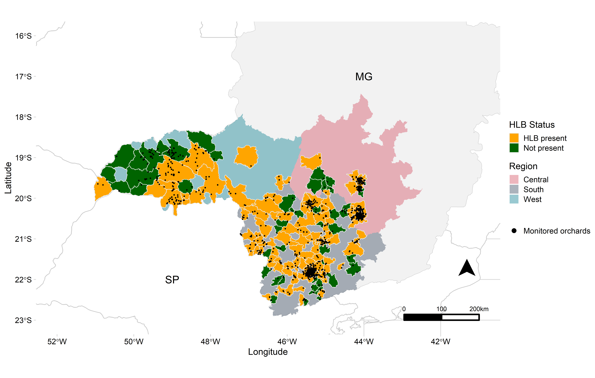

% About

 In this website are available the codes used to reproduce the analysis and results of the research conducted by a D.sc student Kaique dos S. Alves under the supervision of Prof. Emerson Del Ponte, Universidade Federal de Vicosa, MG, Brazil.

  The main objective of the research was to summarize the temporal and spatial aspects of Citrus Huanglongbing in the state of Minas Gerais in Brazil since 2005.  
  
   

## Citation

Alves, K. S., Carmo, L. H. M. d, & Del Ponte, E. M. (2020, April 27). Research compendium: Spatiotemporal spread of Huanglongbing of citrus in Minas Gerais. https://doi.org/10.17605/OSF.IO/23GHM 

